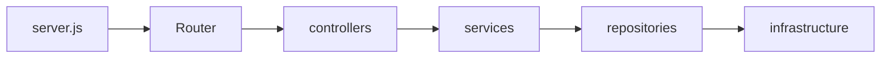
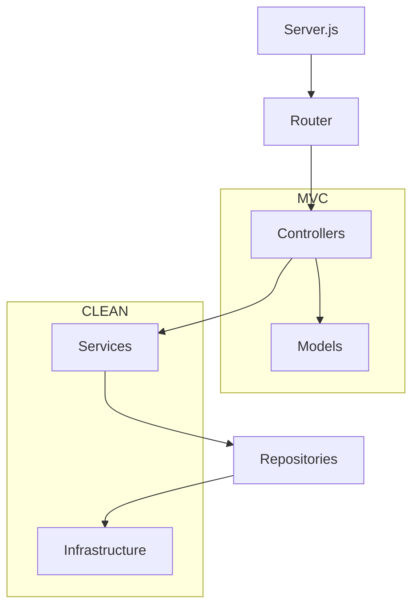

# node-multimedia-server: Un serivodr multimèdia  amb NodeJS i Express.


Aquest projecte és un sevidor de contingut multimèdia generat amb Node.js i Express, i que ofereix una API REST per consultar-ne la informació. L'objectiu d'aquest projecte és fer una introducció al desenvolupament del costat del servidor utilitzant Node.js i Express, i aplicar conceptes d'arquitectura de software com MVC (Model-View-Controller) i el patró Repository, així com les Apis REST.

## Introducció

Les aplicacions del costat del servidor són responsables de gestionar les sol·licituds de clients (per exemple, navegadors web o aplicacions mòbils), processar-les, i enviar-les de tornada amb la informació requerida. Express és un framework per a Node.js que facilita la creació d'aquestes aplicacions, gestionant rutes, peticions i respostes de manera eficient.

En aquest projecte, veurem com s'apliquen diferents conceptes d'arquitectura de software, com ara l'arquitectura en capes i el patró Repository. L'arquitectura en capes ajuda a mantenir el codi modular i fàcil de mantenir, i el patró Repository facilita l'accés a les dades de manera que no depenga directament de la font de dades.

### Arquitectura de l'aplicació

L'arquitectura de l'aplicació es divideix en diferents capes, cada una amb una responsabilitat clara:




1. **server.js**: Configura i inicialitza l'aplicació Express.
2. **router.js**: Defineix les rutes de les peticions i les redirigeix als Controllers.
3. **controllers**: Gestió de les peticions HTTP i la interacció amb el servei.
4. **services**: Conté la lògica de negoci i gestiona les operacions sobre les dades.
5. **repositories**: Accedeix a les fonts de dades (en aquest cas, fitxers d'àudio).
6. **infrastructure**: Conté els mètodes per interactuar amb el sistema de fitxers i obtenir les metadades dels àudios.

Aprofundint un poc més, podem veure com estem seguint una arquitectura MVC (Model-Vista-Controlador), a la que hem *enriquit* amb alguns components més, com una capa de servei i infrastrucura de l'arquitectura CLEAN i amb un patró *Repository*:



En aquest cas:

* Els *Controllers* gestionen les peticions i fan ús de *Services*.
* Els *Services* gestionen la lògica de negoci i interactuen amb els *Repositories* per obtenir dades.
* Els *Repositories* es connecten a *Infrastructure* (o d'accés a dades) per obtenir les dades d'on siga necessari (com fitxers, bases de dades, etc.).
* Els *Models* són utilitzats dins d'MVC per representar les dades dins de l'aplicació.
  
### Introducció a les APIs REST

La manera que tindrem al nostre projecte d'interactuar amb els clients serà a partir d'una API REST.

Una API REST (Representational State Transfer) és una forma d'interactuar amb una aplicació a través de la web utilitzant el protocol HTTP. Les APIs REST permeten que diferents sistemes es comuniquin entre ells mitjançant les operacions estàndard de HTTP, com GET (obtenir dades), POST (afegir dades), PUT (modificar dades) i DELETE (eliminar dades). En aquest projecte, utilitzem una API REST per gestionar les pistes multimèdia i permetre a qualsevol client consultar la informació a través de peticions HTTP.

Els recursos en una API REST estan representats normalment com a URLs, que apunten a dades o entitats de l'aplicació, i que se solen conéixer con **rutes**.

En aquest projecete, es gestionen les següents peticions:

* `GET /pistes`: Retorna un llistat de totes les pistes disponibles.
* `GET /pistes/{id}`: Retorna la informació detallada d'una pista concreta identificada per {id}.
* `POST /pistes`: Permet afegir una nova pista a la base de dades, encar aque no s'utilitza.

També podríem incorporar altres rutes com per exemple:

* `DELETE /pistes/{id}`: Per eliminar una pista específica.

### Com començar

1. **Instal·lar dependències**:
   Per començar a utilitzar l'aplicació, primer has d'instal·lar les dependències utilitzant `npm`:

   ```bash
   npm install
   ```

2. **Llançar l'aplicació**:
   Després d'instal·lar les dependències, pots iniciar el servidor utilitzant:

   ```bash
   npm start
   ```

   Aquesta ordre llançarà el servidor a `http://localhost:3000`.


## package.json

El fitxer `package.json` conté informació sobre el projecte, les dependències que necessita, les versions de les dependències, i els scripts que es poden executar (com `npm start`).

Un exemple de `package.json` pot ser el següent:

```json
{
  "name": "node-express-project",
  "version": "1.0.0",
  "description": "Projecte de demostració per a introduir Express",
  "main": "server.js",
  "scripts": {
    "start": "node server.js"
  },
  "dependencies": {
    "express": "^4.17.1",
    "music-metadata": "^7.0.0"
  }
}
```

On:

- **name**: Nom del projecte.
- **version**: Versió del projecte.
- **description**: Descripció breu del projecte.
- **scripts**: Els scripts que podem executar. `npm start` executa el servidor amb `node server.js`.
- **dependencies**: Les dependències del projecte, com Express i music-metadata.

També tenim la propietat `"type": "module"`, que activa el suport per a mòduls EcmaScrpit. Podeu veure les [diferències entre mòduls ES i CommonJS aci mateixa!](docs/ESModules.md).

## Seguiment de l'execució

Anem a veure el funcionament fent un seguiment de l'execució de l'aplicació.

### 1. **server.js**

Quan s'executa `npm start`, el primer fitxer que s'executa és `server.js`. Aquest fitxer configura l'aplicació Express, aplica els middlewares i defineix les rutes.

>
> **Què és això dels middlewares**
>
> En el context del desenvolupament, un middleware és qualsevol programari que actúa com a *pont* o *intermediari* entre dues parts d'un sistema.
>
> En el context d'Express, els *middlewares* són funcions que intervenen en la gestió i el processament de les peticions HTTP, i s'ubiquen **entre la petició** que fa el client **i la resposta** que el servidor envia. Els middlewares permeten manipular la petició, la resposta, o executar codi abans que es realitze una acció en concret. Per exemple, poden gestionar la validació d'entrades, afegir capçaleres a la resposta, o gestionar l'autenticació de l'usuari.
>
> Aquesta capa ajuda a organitzar el codi i a mantenir l'aplicació modular i flexible.
>

```javascript
import express, { json } from 'express';
import pistaRoutes from './app/routes/pistaRoutes.js';
import pistaService from './app/services/pistaService.js';
import { join } from 'path';
import { fileURLToPath } from 'url';

// Obté el directori actual
const __filename = fileURLToPath(import.meta.url);
const __dirname = join(__filename, '..');

const app = express();
const PORT = 3000;


// Middleware per processar JSON (de moment no s'usa)
app.use(json());

// Middleware Static, per servir fitxers estàtics
app.use('/public', express.static(join(__dirname, 'public'))); 

// Rutes per gestionar pistes
app.use('/pistes', pistaRoutes);

// Inicialitza el servei de pistes
(async () => {
  await pistaService.initializeTracks(); // Carrega les pistes
  app.listen(PORT, () => {
    console.log(`Servidor en funcionament a http://localhost:${PORT}`);
  });
})();
```

El servidor utilitza el middleware `json` per processar les sol·licituds que pugueren contindre dades en format JSON, així com el Middleware `static` per servir fitxers estàtics. Després, es defineixen les rutes per obtenir pistes (usant el mòdul `pistaRoutes`), i després s'inicia el servidor.

### 2. pistaRoutes.js

Aquest fitxer defineix les rutes, o la *miniaplicació* per interactuar amb l'API de pistes.

>
> **Miniaplicació (Router)**
>
> En Express, una miniaplicació o router és una instància d'Express que permet definir un conjunt de rutes agrupades. Aquesta estructura facilita la creació d'aplicacions més modulars i netes, ja que podem organitzar les rutes en fitxers separats, cada un amb la seva pròpia lògica. Aquests routers poden després ser utilitzats per a gestionar rutes específiques dins de l'aplicació, com per exemple, les rutes relacionades amb les "pistes" en aquest cas, que tenen la ruta arrel `/pistes` i després diverses subrutes a dins (`/simple`, `track/{id}` o `/`).

```javascript
import { Router } from 'express';
import { getAll, getAllTracksSmart, getTrack } from '../controllers/pistaController.js';

const router = Router();

router.get('/simple', getAllTracksSmart); // Obtenir pistes en format senzill
router.get('/track/:id', getTrack); // Obtenir una pista per ID
router.get('/', getAll); // Obtenir totes les pistes

export default router;
```

Com veiem, aquest router fa ús de funcions proporcionades pels controladors.

### 3. **pistaController.js**

El controlador gestiona les peticions HTTP. Quan es fa una sol·licitud a una ruta, es crida el mètode corresponent del servei `PistaService`.

```javascript
class PistaController {
  getAll(req, res) {
    const pistes = PistaService.getAllTracks();
    res.json({ tracks: pistes });
  }

  getTrack(req, res) {
    const id = decodeURIComponent(req.params['id']);
    const pista = PistaService.getTrack(id);
    res.json({ trackinfo: pista });
  }

  getAllTracksSmart(req, res) {
    const pistes = PistaService.getAllTracksSmart();
    res.json({ tracks: pistes });
  }
}
```

Cada mètode gestiona una ruta i retorna les pistes o la informació d'una pista específica.

### 4. **pistaService.js**

El servei gestiona la *lògica de negoci* i interactua amb el *repositori* per obtenir les pistes.

```javascript
class PistaService {
  async initializeTracks() {
    const rawPistas = await this.repository.getAllRawPistas();
    this.pistes = rawPistas.map(({ filePath, metadata }) => ({
      id: filePath.split('/').pop(),
      title: metadata.common.title || 'Sense Títol',
      artist: metadata.common.artist || 'Autor Desconegut',
      album: metadata.common.album || 'Àlbum Desconegut',
      duration: metadata.format.duration || 0,
      format: metadata.format.codec || 'Format desconegut',
      genre: metadata.common.genre || 'Gènere desconegut',
      cover: metadata.common.picture || null
    }));
  }

  getAllTracks() {
    return this.pistes;
  }

  getTrack(id) {
    return this.pistes.find(track => track.id === id) || null;
  }
}
```

Aquest mòdul utilitza el repositori `PistaRepository` per obtenir les dades crues de les pistes i transformar-les en un format més útil.

### 5. **pistaRepository.js**

El repositori accedeix als fitxers d'àudio i obté les seves metadades.

> **Patró Repository**
>
>El patró Repository és un patró de disseny que actua com una **capa d'abstracció entre l'aplicació i la font de dades**, com una base de dades o un servei extern. El seu objectiu principal és gestionar l'accés a les dades de manera que l'aplicació no estiga directament depenent de la implementació concreta de l'emmagatzematge de dades. Això permet que l'aplicació siga més flexible, testejable i fàcil de mantenir.
> Un repository proporciona una interfície senzilla per realitzar operacions comunes de la base de dades, com ara crear, llegir, actualitzar i eliminar (CRUD). Això ajuda a mantenir el codi de l'aplicació més net, evitant que la lògica de negoci es mescle amb la lògica de persistència de dades.
>
> Algunes de les funcions típiques d'un repositori podrien ser:
> 
> * `getAll()`: Obté totes les entrades d'una taula o col·lecció.
> * `getById(id)`: Obté un element concret per la seva identificació.
> * `create(item)`: Afegeix un nou element a la base de dades.
> * `update(id, item)`: Actualitza un element existent.
> * `delete(id)`: Elimina un element per la seva identificació.
> El patró Repository ajuda a separar les preocupacions entre la lògica de negoci de l'aplicació i l'accés a les dades, i pot ser útil quan es vol canviar la font de dades (per exemple, passar d'una base de dades SQL a una NoSQL) sense afectar la resta de l'aplicació.
> 
> En el nostre projecte, el Repository permet interactuar amb les dades (per exemple, les pistes o altres entitats) de manera abstracta i simplificada, assegurant que els controladors i altres components de l'aplicació no necessiten conèixer els detalls de la implementació de la base de dades.
>

```javascript
class PistaRepository {
  async getAllRawPistas() {
    const files = await this.fileProvider.listAudioFiles();
    const metadataPromises = files.map(async (filePath) => {
      const metadata = await this.fileProvider.getFileMetadata(filePath);
      return { filePath, metadata };
    });
    return Promise.all(metadataPromises);
  }
}
```

Aquest repositori, fa ṕus de `FileDataProvider` per interactuar amb el sistema de fitxers i obtenir les metadades de cada fitxer d'àudio.

### 6. **FileDataProvider i Infraestructura**

Aquesta classe es fa càrrec de l'accés als fitxers d'àudio al sistema de fitxers, a més de proporcionar les metadades associades a aquests fitxers. L'ús de la classe `FileDataProvider` és fonamental per aconseguir la funcionalitat de repositori de pistes en aquest projecte.

```javascript
class FileDataProvider {
  async listAudioFiles() {
    // Llista els fitxers d'àudio des d'una ubicació predeterminada
    const files = fs.readdirSync('./public/audio');
    return files.filter(file => file.endsWith('.mp3') || file.endsWith('.flac'));
  }

  async getFileMetadata(filePath) {
    // Utilitza 'music-metadata' per obtenir informació sobre el fitxer d'àudio
    const metadata = await mm.parseFile(filePath);
    return metadata;
  }
}
```

La classe `FileDataProvider` és la que fa realment l'operació d'accedir al sistema de fitxers i llegir els metadades dels arxius d'àudio (com títol, autor, durada, etc.). Aquesta funcionalitat és essencial per a l'aplicació, ja que la resta de l'arquitectura depèn d'aquesta informació.

### 7. **Middleware i Gestió d'Errors**

Els *middleware* són funcions que s'executen durant el procés de manipulació de les peticions HTTP, abans de que aquestes arribin a les rutes o controladors. Per exemple, Express permet utilitzar middleware per validar dades, gestionar errors, o servir fitxers estàtics.

Un exemple de middleware per gestionar errors en aquest projecte:

```javascript
// Middleware per gestionar errors
app.use((err, req, res, next) => {
  console.error(err.stack);
  res.status(500).send('Alguna cosa ha anat malament!');
});
```

Aquest middleware captura qualsevol error que es produeixi en qualsevol moment del procés de manipulació de la petició i el respon amb un missatge d'error.

